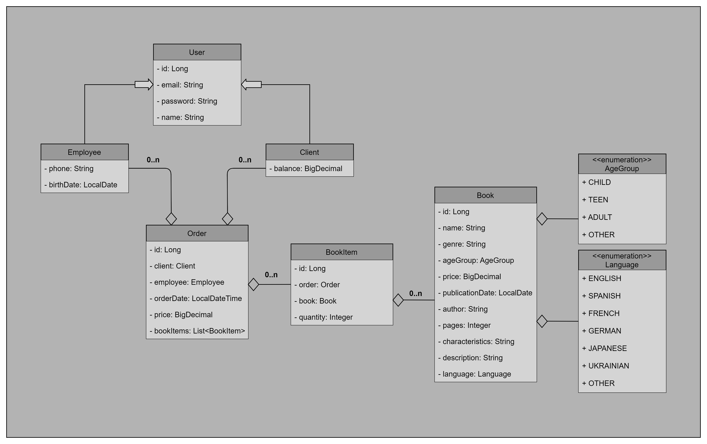
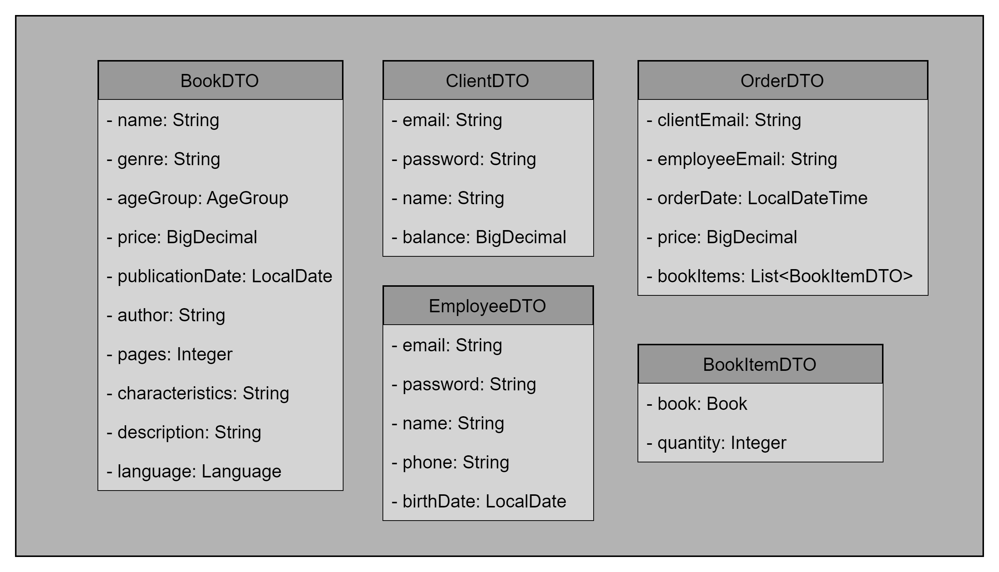

# Book Store. Spring Project

The purpose of this task is to check your knowledge and understanding in Java and Spring.

Duration: **15** hours

## Description

Your objective is to develop a "Book Store Service" following the MVC pattern.

> Project may have two main roles of authority: customer and employee.

The project structure is already set up, with essential classes waiting for implementation in their respective folders.
Your project is organized into several packages. Here's a brief overview of each:

### Packages Overview

#### `conf`

- Houses all configuration classes.

#### `controller`

- Contains controller files.

#### `dto`

- Contains DTO files.

#### `model`

- Contains all model classes.

#### `exception`

- Contains custom user exception files.

#### `repo`

- Contains repository files.

#### `service`

- Includes interfaces with declared methods for all services.

- `impl`: Encompasses implementations of declared services.

The class diagram of the Domain model is shown in the figure below:

### Permissions

> For Any Registered Users

- Access a list of available books.
- View detailed information about any book.
- Edit personal information and view user profile.

> For Employees

- Add, edit, or delete books from the list.
- Confirm orders placed by customers.
- Block or unblock customer accounts.
- Access a list of registered customers.

> For Customers

- Add books to the basket for purchase.
- Delete their account.
- Submit orders for purchase.

### Services

Below is a list of available services with corresponding methods for implementation.

> Note: You can add your own methods to existing services, as well as create additional services.

#### OrderService

* `getAllOrdersByClient(email: String)`
  Retrieves a list of all orders by client's email placed in the system.
* `getAllOrdersByEmployee(email: String)`
  Retrieves a list of all orders by employee's email placed in the system.
* `addOrder(order: OrderDTO)`
  Adds a new order to the system, incorporating the provided order details.

#### EmployeeService

* `getAllEmployees()`
  Retrieves a list of all employees registered in the system.
* `getEmployeeByEmail(email: String)`
  Fetches details of a specific employee based on their email.
* `updateEmployeeByEmail(email: String, employee: EmployeeDTO)`
  Updates the information of an existing employee identified by their email with the provided details.
* `deleteEmployeeByEmail(email: String)`
  Removes an employee from the system based on their email.
* `addEmployee(employee: EmployeeDTO)`
  Registers a new employee in the system with the provided details.

#### ClientService

* `getAllClients()`
  Retrieves a list of all clients (customers) registered in the system.
* `getClientByEmail(email: String)`
  Fetches details of a specific client based on their email.
* `updateClientByEmail(email: String, client: ClientDTO)`
  Updates the information of an existing client identified by their email with the provided details.
* `deleteClientByEmail(email: String)`
  Removes a client from the system based on their email.
* `addClient(client: ClientDTO)`
  Registers a new client in the system with the provided details.

#### BookService

* `getAllBooks()`
  Retrieves a list of all books available in the store.
* `getBookByName(name: String)`
  Fetches details of a specific book based on its name.
* `updateBookByName(name: String, book: BookDTO)`
  Updates the information of an existing book identified by its name with the provided details.
* `deleteBookByName(name: String)`
  Removes a book from the system based on its name.
* `addBook(book: BookDTO)`
  Adds a new book to the system with the provided details.

## Requirements

Ensure implementation of the following:

- `Spring Data JPA` for efficient data management.
-  Incorporate `Spring Security` for robust authentication and authorization.
-  Enable `Internationalization and Localization` to support English and any language you choose.
-  Implement `Validation` for data integrity.
-  Establish `Error handling` for graceful error management.
-  Utilize `DTOs` - data transfer objects structured as illustrated below:

## Would be nice

Consider the following additional features:

- Incorporate `Logging` for comprehensive system monitoring.
- Implement `Pagination and Sorting` for enhanced data presentation.

## Recommendations

> Use wrapper classes (like Long, Integer, etc.) instead of primitive types whenever possible.

- Utilize `Lombok` for streamlined Java code.
- Use `ModelMapper` for easy mapping between objects.
- Utilize `Thymeleaf` for HTML templating.
- Explore the `test` folder to execute provided test cases for your solution.
- Refer to the `main\resources\sql` folder for SQL scripts to initialize data.

## Special message

- Make the most of the time available.
  While we understand you may not cover all the points,
  aim to accomplish as much as possible within the given duration of 15 hours.
